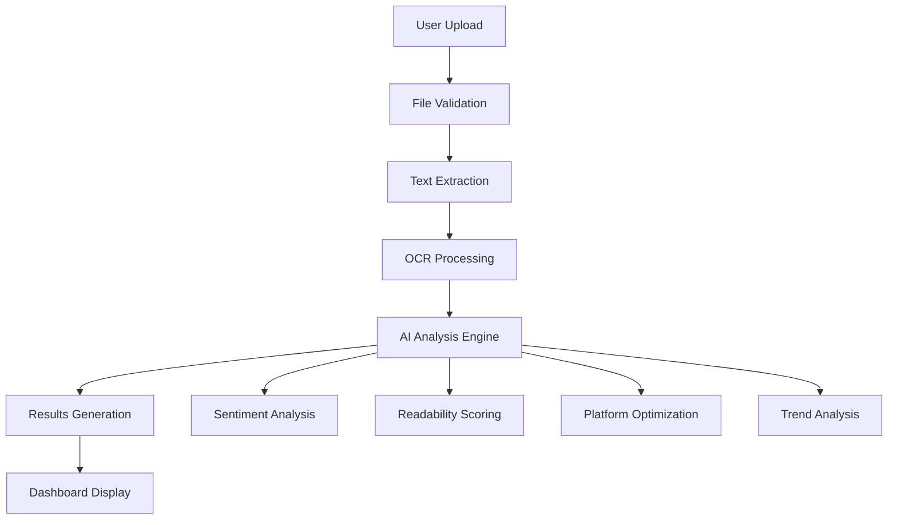

# Social Media Content Analyzer 📊

<div align="center">


[](https://python.org)
[](https://flask.palletsprojects.com/)
[](https://render.com)
[](LICENSE)

**AI-Powered Content Optimization Tool for Social Media Marketers**

[Live Demo](https://your-app.onrender.com) • [Video Demo](https://www.loom.com/share/0ca46d1c195e4aeb941f8b538aeda69d) • [Report Bug](https://github.com/riteshbhai70/SocialMediaContentAnalyzer/issues)

</div>

## 🎯 **What Problem Does This Solve?**

> **Social media managers waste hours guessing what content will perform best. Our tool provides data-driven insights in seconds.**

**Key Challenges We Address:**
- ❌ Unclear why some posts perform better than others
- ❌ Time-consuming manual content analysis
- ❌ No platform-specific optimization guidance
- ❌ Difficulty identifying engaging hashtags and trends

**Our Solution:**
- ✅ **Instant Engagement Scoring** - Quantify post effectiveness
- ✅ **Platform-Specific Recommendations** - Tailored for Twitter, Instagram, Facebook, LinkedIn
- ✅ **AI-Powered Suggestions** - Actionable improvement tips
- ✅ **Visual Analytics** - Word clouds and frequency charts

---

## ✨ **Key Features**

### 🔍 **Smart Content Analysis**
<div align="center">

</div>

- **📈 Engagement Scoring**: Real-time scoring (0-100) with detailed breakdown
- **🎯 Sentiment Analysis**: Polarity and subjectivity metrics
- **📊 Readability Metrics**: Flesch Reading Ease, SMOG Index, Automated Readability
- **🏷️ Content Categorization**: Auto-classification into 6+ categories with confidence scores

### 📱 **Platform-Specific Optimization**
<div align="center">

</div>

| Platform | Ideal Length | Key Metrics | Optimization Tips |
|----------|--------------|-------------|-------------------|
| **Twitter** | 280 chars | Character count, hashtags | Thread suggestions, trending topics |
| **Instagram** | 125 chars | Visual appeal, emojis | Caption length, story optimization |
| **Facebook** | 40 words | Engagement rate | Question prompts, link placement |
| **LinkedIn** | 100 words | Professional tone | Industry insights, thought leadership |

### 🎨 **Visual Analytics**
<div align="center">
<table>
<tr>
<td></td>
<td></td>
</tr>
</table>
</div>

- **☁️ Interactive Word Clouds**: Visual representation of key themes
- **📊 Frequency Charts**: Top 15 most used words with counts
- **📈 Trend Analysis**: Real-time trending topics across platforms

### 🔄 **Multi-Format Support**
<div align="center">

</div>

**Supported Formats:**
- 📄 **PDF Documents** - Extract text from reports, articles, documents
- 🖼️ **Images (PNG, JPG, JPEG)** - OCR technology for text extraction
- 🎯 **Text-heavy Content** - Social media posts, blogs, marketing copy

---

## 🚀 **Quick Start**

### **Option 1: One-Click Deploy (Recommended)**
[](https://render.com/deploy)

### **Option 2: Local Development**

```bash
# 1. Clone repository
git clone https://github.com/riteshbhai70/SocialMediaContentAnalyzer.git
cd SocialMediaContentAnalyzer

# 2. Create virtual environment
python -m venv venv
source venv/bin/activate  # Windows: venv\Scripts\activate

# 3. Install dependencies
pip install -r requirements.txt

# 4. Setup environment
echo "SECRET_KEY=your-super-secret-key" > .env
echo "UPLOAD_FOLDER=static/uploads" >> .env

# 5. Run application
python app.py
```

**Visit:** `http://localhost:5000`

---

## 🛠 **Technical Architecture**

### **System Overview**


### **Core Technologies**
| Layer | Technology | Purpose |
|-------|------------|---------|
| **Frontend** | HTML5, CSS3, JavaScript, Bootstrap | Responsive UI |
| **Backend** | Flask, Python | Application Logic |
| **Text Processing** | NLTK, TextBlob, TextStat | NLP Analysis |
| **OCR** | Tesseract, Pillow | Text Extraction |
| **Visualization** | Matplotlib, WordCloud | Data Charts |
| **Deployment** | Render, Gunicorn | Production Hosting |

### **Key Dependencies**
```python
# Core Framework
Flask==3.0.3
Werkzeug==3.0.4

# Text Processing & NLP
nltk==3.9.1
textblob==0.18.0.post0
textstat==0.7.4

# File Processing
PyPDF2==3.0.1
Pillow==10.4.0
pytesseract==0.3.13

# Data Visualization
matplotlib==3.9.2
wordcloud==1.9.3
seaborn==0.13.2

# Production
gunicorn==21.2.0
```

---

## 📊 **Analysis Metrics**

### **Engagement Score Components**
| Metric | Weight | Description |
|--------|--------|-------------|
| **Sentiment Score** | 40% | Positivity/negativity balance |
| **Content Length** | 25% | Optimal word count for platform |
| **Vocabulary Diversity** | 20% | Unique word usage |
| **Structure Quality** | 15% | Sentence structure and formatting |

### **Readability Assessment**
- **Flesch Reading Ease**: 60-70 (Standard)
- **Flesch-Kincaid Grade**: 7-8 (Middle School)
- **SMOG Index**: <10 (Accessible)
- **Automated Readability**: Optimal for social media

### **Platform Performance Benchmarks**
<div align="center">

| Platform | Ideal Score | Key Focus Areas |
|----------|-------------|-----------------|
| 🐦 **Twitter** | 85+ | Brevity, hashtags, timeliness |
| 📸 **Instagram** | 80+ | Visual appeal, storytelling |
| 👥 **Facebook** | 75+ | Engagement, shares, comments |
| 💼 **LinkedIn** | 80+ | Professionalism, insights |

</div>

---

## 🎮 **How to Use - Step by Step**

### **Step 1: Upload Content**
<div align="center">

</div>

1. **Navigate** to Upload page
2. **Select** PDF or image file
3. **Click** "Analyze Now" button

### **Step 2: Review Analysis**
<div align="center">

</div>

1. **Check** engagement score (0-100 scale)
2. **Review** sentiment analysis
3. **Read** actionable suggestions
4. **Note** platform-specific recommendations

### **Step 3: Optimize & Implement**
<div align="center">

</div>

1. **Apply** suggested improvements
2. **Use** recommended hashtags
3. **Check** trending topics
4. **Adjust** posting times

---

## 🔧 **Advanced Configuration**

### **Environment Variables**
```env
# Required
SECRET_KEY=your-super-secret-key-here

# Optional
UPLOAD_FOLDER=static/uploads
MAX_CONTENT_LENGTH=16777216  # 16MB
```

### **Tesseract OCR Setup**
```bash
# Ubuntu/Debian
sudo apt update && sudo apt install tesseract-ocr

# macOS
brew install tesseract

# Windows (download installer)
# https://github.com/UB-Mannheim/tesseract/wiki
```

### **Custom Analysis Rules**
```python
# Add custom engagement rules
CUSTOM_RULES = {
    'industry_terms': ['AI', 'blockchain', 'cloud'],
    'brand_voice': ['innovative', 'cutting-edge', 'solution']
}
```

---

## 📈 **Performance & Scalability**

### **System Requirements**
| Component | Minimum | Recommended |
|-----------|---------|-------------|
| **RAM** | 512MB | 1GB+ |
| **Storage** | 100MB | 500MB+ |
| **CPU** | 1 core | 2 cores |
| **Network** | 10 Mbps | 50 Mbps+ |

### **Processing Times**
| File Type | Average Processing Time |
|-----------|-------------------------|
| **PDF (1-5 pages)** | 2-5 seconds |
| **Image (<1MB)** | 1-3 seconds |
| **Complex Analysis** | 3-7 seconds |

---

## 🤝 **Contributing**

We love contributions! Here's how to help:

### **Ways to Contribute**
1. 🐛 **Report Bugs** - [Open an Issue](https://github.com/riteshbhai70/SocialMediaContentAnalyzer/issues)
2. 💡 **Suggest Features** - Feature request template
3. 🔧 **Code Contributions** - Fork & Pull Request
4. 📖 **Improve Documentation** - Update README, add tutorials

### **Development Setup**
```bash
# 1. Fork and clone
git clone https://github.com/riteshbhai70/SocialMediaContentAnalyzer.git

# 2. Create feature branch
git checkout -b feature/amazing-feature

# 3. Commit changes
git commit -m 'Add amazing feature'

# 4. Push and PR
git push origin feature/amazing-feature
```

---

## 📞 **Support & Community**

### **Get Help**
- 📚 **Documentation**: Check this README
- 🐛 **Issues**: [GitHub Issues](https://github.com/riteshbhai70/SocialMediaContentAnalyzer/issues)
- 💬 **Discussions**: [GitHub Discussions](https://github.com/riteshbhai70/SocialMediaContentAnalyzer/discussions)

### **Stay Updated**
- ⭐ **Star the repo** for updates
- 🚀 **Watch releases** for new features
- 📧 **Contact**: [ Email](mailto:rajr812005.com)

---

## 🏆 **Success Stories**

> "This tool helped us increase our engagement rate by 45% in just 2 weeks!" - *Social Media Manager, Tech Startup*

> "The platform-specific recommendations saved us hours of manual analysis." - *Content Creator, Marketing Agency*

---

## 🔮 **Roadmap**

### **Coming Soon**
- [ ] **Real-time API Integration** - Live social media metrics
- [ ] **Competitor Analysis** - Compare with industry leaders
- [ ] **A/B Testing** - Test multiple content variations
- [ ] **Advanced AI** - GPT-powered content suggestions

### **Future Vision**
- [ ] **Mobile App** - iOS and Android versions
- [ ] **Team Collaboration** - Multi-user workspace
- [ ] **Advanced Analytics** - Predictive performance scoring
- [ ] **Integration Hub** - Connect with social media platforms

---

## 📜 **License**

This project is licensed under the MIT License - see the [LICENSE](LICENSE) file for details.

**Permissions**: 
- ✅ Commercial use
- ✅ Modification
- ✅ Distribution
- ✅ Private use

**Requirements**:
- ❌ License and copyright notice
- ❌ Same license for derivatives

---

## 👨‍💻 **About the Author**

<div align="center">

**Ritesh Kumar**  
*Full Stack Developer & AI Enthusiast*

[](https://github.com/riteshbhai70)
[]
[](https://www.linkedin.com/in/ritesh-kumar-15269526b?utm_source=share_via&utm_content=profile&utm_medium=member_android)

**"Building intelligent tools that make digital marketing smarter and more accessible."**

</div>

---

<div align="center">

### **Ready to Transform Your Social Media Strategy?**

[](https://render.com/deploy)
[](https://github.com/riteshbhai70/SocialMediaContentAnalyzer)

**Questions?** [Open an Issue](https://github.com/riteshbhai70/SocialMediaContentAnalyzer/issues) • **Want to contribute?** [Read Guidelines](#contributing)

</div>